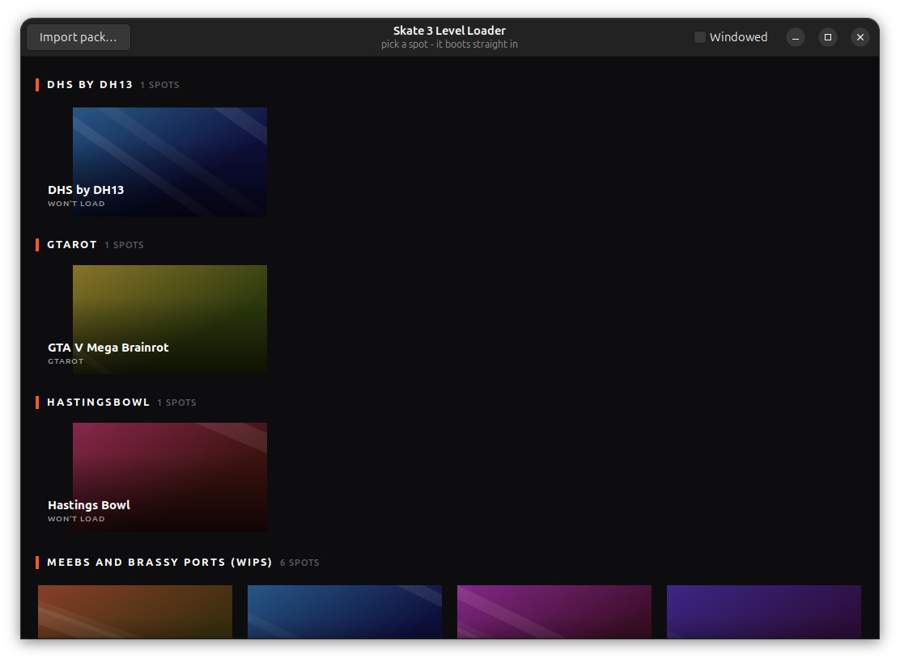

# Skate 3 Level Loader

Pick a map, watch it load, skate. The launcher owns map selection, so the game
never has to manage DLC — you keep unlimited packs imported and it stages
exactly one per launch.

Built against [skate3recomp](https://github.com/mchughalex/skate3recomp) with a
few engine-side patches (see [Engine changes](#engine-changes)).



---

## Install

Download the archive for your platform from the
[releases page](https://github.com/andrewnakas/skate3-level-loader/releases) and
unpack it. Each one carries the launcher and the patched engine; you supply the
game files from your own copy of Skate 3, once, on first run.

| | |
|---|---|
| **Linux** | `tar xzf skate3loader-*-linux-x86_64.tar.gz && ./skate3loader/skate3loader` |
| **Windows** | unzip, run `skate3loader-gui.exe` (`skate3loader.exe` for the commands below) |
| **macOS** | unzip, then `xattr -dr com.apple.quarantine "Skate 3 Level Loader.app"` |

The macOS build is not notarized, so Gatekeeper blocks it until you either run
that `xattr` line or use **System Settings → Privacy & Security → Open Anyway**.
Sequoia removed the old Control-click shortcut.

Unpack the engine archive into an `engine/` folder **beside** the launcher — on
macOS beside the `.app`, not inside it, because anything written into the bundle
invalidates its signature and it will not start:

```
Skate 3 Level Loader.app        skate3loader/            skate3loader\
engine/                         engine/                  engine\
  skate3                          skate3                   skate3.exe
  librexruntime.dylib             librexruntime.so         rexruntime.dll
```

**First run** asks for your Skate 3 ISO and Title Update 3 package, then hands
them to the game's own installer - the loader extracts nothing itself. If a
Skate3Recomp install is already on the machine it offers that instead, and
nothing is extracted twice.

## Quick start

```bash
./skate3loader doctor     # check the environment first
./skate3loader            # open the library, click a map
```

That's the whole workflow: click a card, the loading screen covers the boot, and
you drop into the map with no menus. Quit the game and the library comes back.

### Command line

```
./skate3loader                     open the library (default)
./skate3loader doctor              check freeskate, the game binary, disk, packs
./skate3loader list                list imported packs and their maps
./skate3loader import <path.big>   import one pack
./skate3loader scan <dir>          import every usable pack in a folder
./skate3loader play <world-id>     boot straight into one map, no GUI
./skate3loader run [world-id]      play, starting at the in-game map picker
./skate3loader manual <pack-id>    stage a pack, no automation — you navigate
./skate3loader selftest           prove this build is intact (what CI runs)
```

---

## Getting maps in

Drag a `.big` onto the window — or a whole folder of them — and it is installed.
That is the whole flow; `Import pack…` in the header does the same thing with a
file chooser, and `skate3loader scan ~/Downloads` does it from a terminal.

The launcher ships knowing **43 packs by name**, including which of their maps
load and which hang, but not the pack files themselves — those are not ours to
distribute. Nothing you cannot play is shown, so a fresh install is just the
game plus a place to drop things. Drop a pack it already knows and it arrives
complete, tested status and all.

## The maps the launcher already knows about

A release ships the **catalog** but not the packs: 43 packs and 134 maps, with
their world ids, spawn nodes and - for the ones that have been through the
sweep - whether they load or hang. Records with no file on this machine are not
displayed at all; they are memory, waiting for the matching `.big` to be dropped
in. `Locate pack file…` appears on a pack heading if one goes missing later.

That split is deliberate: the curation took 120 test runs to establish and is
worth having on a fresh install; the file paths belonged to one machine.

## Adding maps

Drop your downloaded packs in a folder and point `scan` at it:

```bash
./skate3loader scan ~/Downloads/packs
```

It explains every rejection rather than silently skipping. Two formats work:

| Format | What it is | Notes |
|---|---|---|
| **STFS container** | signed `LIVE`/`CON`/`PIRS` package | Preferred — installs itself, no header needed |
| **`.big` + `.header`** | raw archive plus its content header | The header must be present |

### Packs with no `.header`

Plenty of community packs ship a bare `<name>_00000000.big`. Generate the header:

```bash
python3 scripts/makeheader.py "path/to/pack_00000000.big"
./skate3loader scan ~/Downloads/packs        # re-scan to pick it up
```

The header is a 328-byte descriptor with nothing signed in it; the only rule
that matters is that its content id equals the package directory name, which the
generator guarantees. Verified working — the game mounts packs carrying one.

### Packs that won't import

- **Loose `DIST_` folders** — world geometry with no DLC package. There's no
  Locations menu entry for the game to select, so these can't be loaded.
- **"found no freeskate locations"** — the archive has no location strings, so
  it isn't a map pack in the format the loader understands.

---

## Diagnosing a map that won't load

```bash
./skate3loader manual <pack-id> --windowed
```

Stages the DLC and gets out of the way: no macro, no warp, no loading cover. You
navigate the game's own menus.

This is how the "14 broken maps" turned out to be wrong. Every hypothesis ruled
out before it had been tested with the loader's automation still driving, so
"the loader breaks these" and "these are broken" were never separated. Hastings
Bowl loaded by hand on the first try, and now loads unattended in ~62 s with the
boot warp disabled for that pack:

```json
"settings": {
  "skate3_warp_substitute_item":   false,
  "skate3_warp_substitute_folder": false,
  "skate3_warp_substitute_slug":   false,
  "skate3_warp_substitute_node":   false,
  "skate3_warp_substitute_lookup": false
}
```

All **five** switches matter — `_node` and `_lookup` default to true and aren't
in the usual disable list, which is why an earlier workaround that turned off
only the first three never actually stopped the substitution.

---

## How long a map takes

Boot to skating, measured phase by phase with `scripts/boottime.py`:

```
                    before   now
host + guest boot     3.0s   3.8s
press-start           2.4s   2.3s
boot world load       4.7s   4.6s
macro settle          2.5s   0.8s
macro                22.0s   7.6s     <-
activate              4.6s   5.3s
TOTAL                40.1s  25.3s
```

The macro was more than half the wait. Most of it was ten tab presses at 1500 ms
each, and the tab strip **clamps** on Locations - so the presses are idempotent
and the long wait bought nothing. 300 ms, verified by screenshot on two maps.

`press-start`, `boot world load` and `activate` are real work; there is no timer
hiding in them. If a boot is slow on your machine, raise the waits back up:

```bash
SKATE3LOADER_SETTLE_MS=2500 SKATE3LOADER_TAB_DELAY_MS=1500 ./skate3loader
```

## Advanced

**Advanced** in the header opens the experiments. Three things live there:

**How a map is reached.** The default drives the pause menu with a timed macro
and is the only path verified to land the right map. Two alternatives are kept
switchable rather than deleted, each labelled with what it actually does:

| | |
|---|---|
| Standard | ~25 s, 120 sweep runs behind it |
| Direct boot | skips the frontend states; verified to land, worth ~0.5 s |
| Engine navigation | known broken - the cursor it steers by never moves |

**Diagnostics.** `Trace DLC content loading` logs every call through the guest's
content path - the content manager, the driver's mount, each archive added by
path, each content file opened. This is the tool for a pack that never mounts.
Both it and direct boot were ported from
[SK8-Engine](https://github.com/SK8-ENGINE/SK8-Engine) (MIT), a sibling fork of
the same upstream.

**Menu timings.** The measured defaults, editable. Raise them if a map lands
somewhere unexpected on a slower machine.

## In-game map picker

Press **backtick** (or the **Xbox Guide** button) while skating to switch maps
without going back to the library.

Every entry is tagged **RESTARTS**, because switching relaunches the game — the
installed DLC set is fixed at boot. Expect ~27 s. The launcher stays alive
across the restart and covers it with the loading screen.

Keys: d-pad/stick to move, **A** to pick, **B** to cancel. Moving the mouse
takes over the selection; leaving it parked over the list doesn't.

---

## Which maps actually work

Cards are labelled from real test runs, not guesswork:

- **normal card** — verified to load
- **CONFIRMED** — additionally matched against a reference screenshot
- **WON'T LOAD** — tested, and it hangs or never renders

Some community packs simply don't load in this build. They're labelled so you
don't click into a hang. Current catalog: **41 of 54 maps playable.**

40 were verified together on 2026-08-17 — 120 runs, every map reproducible
across its runs and distinct from every other, zero failures. Both thresholds
cleared by more than 20x. See [Reliability](docs/reliability.md) for the numbers,
the two flakes that turned up, and the retry rules they produced.

If a boot flakes, the launcher retries it once behind the loading screen rather
than showing you an error — but only for maps already proven to load, so a
known-broken one still fails fast.

---

## Verifying maps yourself

No log line can tell you which map you actually landed in — the boot warp
redirects the stream, so the log names the requested world whatever the menu
really did. The only ground truth is a screenshot.

```bash
python3 scripts/verifyspot.py <world-id>            # boot one map, photograph it
python3 scripts/verifyspot.py <pack-id>:<index>     # when a world id is ambiguous
python3 scripts/sweep.py --status boots             # the maps that should work (~2.2h)
python3 scripts/sweep.py                            # every map, 3 runs, contact sheet
python3 scripts/sweep.py --only skate-it.13 --runs 3
python3 scripts/sweep.py --report                   # re-judge existing shots, boots nothing
```

`--status boots` is the regression gate: it covers exactly the maps recorded as
working, and exits 0 only if every one was reproducible and distinct. A map
recorded as `stalls` scores `EXPECTED FAIL` instead of failing the run, so
keeping a broken pack imported doesn't make the suite permanently red.

**A `stalls` map that renders is not automatically recovered.** `verifyspot` now
photographs on timeout instead of reporting "never rendered" with no picture, so
a map whose macro confirmed nothing still yields a shot — of the stock world it
was left in. Eleven such maps came back "rendered" and all eleven were within
distance 2–21 of each other: one place, not eleven. Recovery has to clear the
distinctness bar too, which is what the `STILL STUCK` verdict is for.

`sweep.py` writes `work/sweep/sweep.md`, `sweep.json` and a labelled
`contact.png`. It judges three ways:

- **reproducible** — a map's runs agree with each other (needs no reference)
- **distinct** — its shots are far from every other map's (needs no reference)
- **MATCH** — matches a confirmed reference in `references/`

To promote a shot to a reference once you've eyeballed the contact sheet:

```bash
cp work/sweep/<pack>.<index>__s1.png references/<pack>.<index>.png
```

Exit codes: `0` match, `2` nothing rendered, `3` wrong place, `4` no reference.

### Offline tests

These need no game and run in seconds:

```bash
python3 scripts/classifier_test.py       # the retry rule, against every real log
python3 scripts/gui_failure_test.py      # the launcher's retry and failure paths
python3 scripts/display_test.py          # the capture guard writes what it claims
python3 scripts/switch_request_test.py   # the in-game picker's relaunch request
python3 scripts/sweep_merge_test.py      # a --only re-run keeps the other results
```

---

## Layout

```
loader/           the launcher
  app.py          GTK application and window flow
  session.py      launch -> watch -> hand over -> come back
  launch.py       spawning the game, and its scrubbed child environment
  staging.py      content staging, via the vendored freeskate
  setup.py        first run: the engine's own ISO installer, driven
  proc.py         finding and killing the game on all three platforms
  config.py       bundle / app / user-state paths, per platform
  selftest.py     what CI runs to prove a build is intact
  catalog.py      packs and maps on disk, and their verified status
  navigate.py     the pad macro that reaches a map
  spotcheck.py    judging a screenshot
  fingerprint.py  the perceptual hash, chosen by measurement
  display.py      keeps the desktop in a state where capture works
scripts/          tools: verifyspot, sweep, makeheader, capture, hashcheck, ...
catalog/          one JSON per imported pack
references/       confirmed screenshots, and known-bad ones in _wrong/
tests/corpus/     distilled run logs, so classifier_test can run in CI
packaging/        the PyInstaller spec and its runtime hook
work/             test output (gitignored)
```

---

## Requirements

Running a **release build**: nothing but your own Skate 3 files. GTK, Python and
the engine are all in the archive.

Running from a **checkout**: Python 3.11+, PyGObject (GTK 3), pycairo, psutil, and
a built `skate3recomp` binary. `./skate3loader doctor` checks all of it.

The test harness under `scripts/` additionally wants Pillow, `xprop`, and Linux -
it drives X11 capture, `/dev/shm` and GNOME settings, and is deliberately left
out of the packaged app.

freeskate is **vendored** at `loader/vendor/freeskate.py` and called in-process,
so no sibling checkout is needed. `scripts/vendor_check.py --against
../freeskate/freeskate` catches the two copies drifting apart.

## Building the release

Three platforms, built by CI:

```bash
pyinstaller --noconfirm --clean packaging/skate3loader.spec   # locally, any platform
```

- `.github/workflows/ci.yml` — offline tests plus a GTK canary on all three OSes,
  every push.
- `.github/workflows/loader-release.yml` — the launcher, on GitHub-hosted runners.
  Linux builds inside an `ubuntu:22.04` container so the glibc floor stays 2.35.
- `.github/workflows/engine-release.yml` — the engine, on **self-hosted** runners,
  because the build recompiles the game from a dump that cannot leave your
  machines. `workflow_dispatch` only; read the security note at the top of that
  file before making this repository public.

Cut a release by making the draft first, letting each machine fill in its engine
when it is free, then pushing the tag:

```bash
gh release create v0.1.0 --draft --notes-file NOTES.md
gh workflow run engine-release.yml -f tag=v0.1.0 -f platforms=linux
git push origin v0.1.0        # builds the loader and publishes
```

---

## Gotchas

**A locked screen makes every screenshot black.** An unattended sweep has no
input, the session locks, and captures come back pure black while the logs look
perfectly healthy. `loader/display.py` handles this automatically; if you see
inexplicable black shots, that's the first thing to check.

**Never run two sweeps at once.** Each run kills any live game, so concurrent
batches silently truncate each other.

**Leaked shared memory hangs the next start.** A killed game leaves a 4.5 GiB
`/dev/shm/xenia_memory_*` segment. The loader cleans these up; by hand it's
`rm -f /dev/shm/xenia_memory_*`.

---

## Engine changes

The loader depends on patches in a `skate3recomp` fork, mainly:

- the in-engine loading overlay and level picker (`skate3_loader_overlay.cpp`)
- warp/selection support (`skate3_warp.cpp`)
- boot automation in `skate3_demo_path.cpp`
- a synthetic auto-tap fix in the SDK, so the title-screen `START` press isn't
  clobbered by the dialog `A` press

Build with `cmake --build out/build/linux-release --target skate3` — that
compiles the SDK change and deploys `librexruntime.so` in one step.
